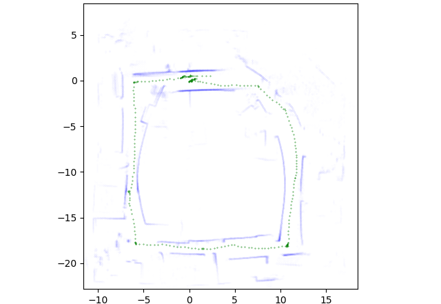

# graph-slam-python
A simple 2D graph-slam system in python 3. For Intel dataset, first 2000 datapoints would look like this:

where the green dots are localization after optimization and blue dots are the map.

## Requirements

* scipy

* numpy

* sklearn

* unittest

* matplotlib (for plotting only)

* g2opy

To install `g2opy`: https://github.com/uoip/g2opy#installation

## Datasets

The datasets used in this SLAM demo are from http://ais.informatik.uni-freiburg.de/slamevaluation/datasets.php

* aces

* intel

## Install

Install the required packages first and then run `python3 setup.py install` under the root directory

## Usage

Download the data from http://ais.informatik.uni-freiburg.de/slamevaluation/datasets.php

Run `python3 read_data.py` under utils to convert the data to the `.npy` dataset

Run `python3 graph_slam.py intel 0.1` to use icp for 2D SLAM. `intel` is the dataset name, `0.1` is the threshold for adding an edge to the graph

